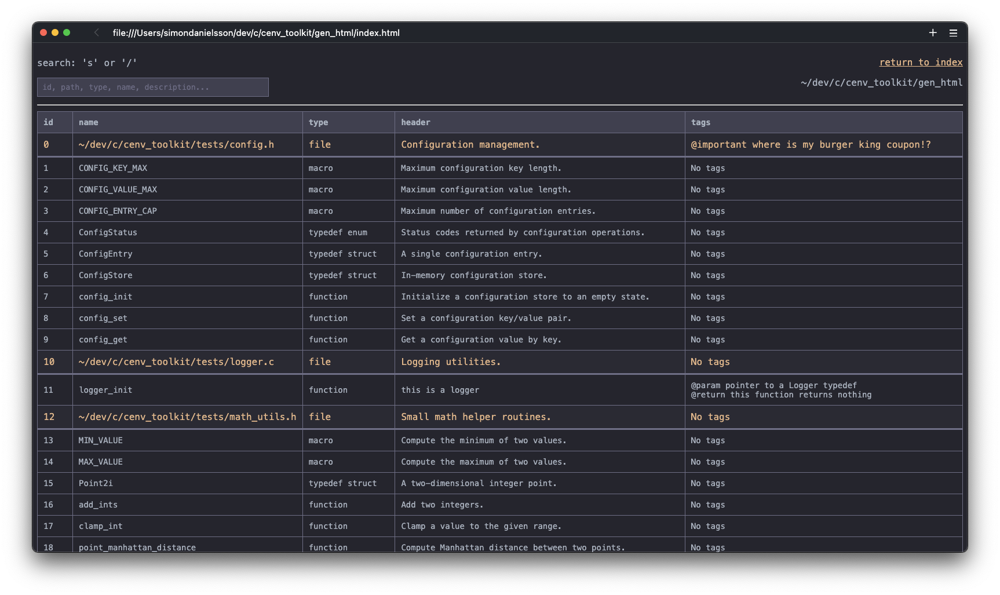
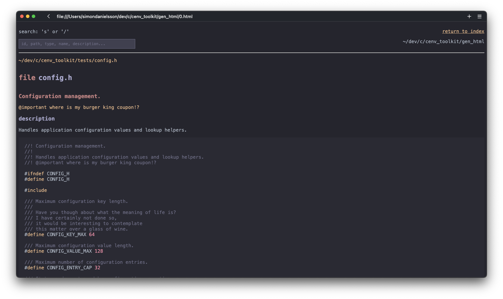

<h2 align="center">cdok</h2>
  
<p align="center">
    
  
</p>
  
<p align="center">
  <a href="#info">Info</a> •
  <a href="#install">Usage</a> •
  <a href="#usage">Usage</a> •
  <a href="#license">License</a>
</p>  
  
---
<div id="info"></div>

## Info
  
cdok generates documentation from c source code. It generates a static html page you can browse, similar to the 'cargo doc' system from Rust. The syntax is simple to understand and is explained in the usage section.
  
Prerequisites:  
- git  
- curl  
- a C compiler  
  
> [!IMPORTANT]  
> 1. Only support for unix systems.
> 2. Since cdok is heavily opinionated and built for my own specific workflow, I can't
> guarantee that this will function properly on your machine (or be enjoyable
> to use.)
  
cdok relies on [nob.h](https://github.com/tsoding/nob.h) (a header-only
build-system) for compilation.  
  
<div id="install"></div>
  
## Install
  
``` terminal
git clone https://github.com/simon-danielsson/cdok.git
cd cdok
run release

# now you have an executable ready to use: ./build/release/cdok
# add this to a binary path or bash alias
```
  
---
<div id="usage"></div>
  
## Usage
  
``` terminal
cdok -s <source file(s)> -d <dest path> -o [open directly in browser]

The destination path is where the generated html files will be placed.

example:
cd ./my_project
mkdir -p .cdok-gen
cdok -s ./src -d ./.cdok-gen -o
```
  
The documentation syntax is explained within the following example code:
  
``` c
//! Math utilities
//!
//! Simple utilities for calculating numbers.
//! 
//! A good practice is to give every file in your project a header
//! like this one. 
//! <--- "//!" is the syntax used for file headers.
//! 
//! @important This is the file header comment.

// There are three tags you can use to spice up your documentation apart from
// headers and comments: @important, @param and @return. 
// 
// These tags are not bound to any specific rule or syntax, so you can 
// place whatever text you want after them - you can use as many tags as you 
// want in a single piece of documentation, with the caveat that they can not
// be multi-line.
// The cdok parser doesn't care where the tags are so you can place a...
// @important hello
// ...tag anywhere and it will work the same as placing tags at the end or
// grouping tags together.

// cdok is not using the standard "//" or "/**/" comments as doc comments 
// so that you, as the programmer, can be explicit about which comments you
// want to use as documentation and which should be used internally only


/// Used for setting factor in submult() function
#define MULT 5 // only adding a header is fine too

/// sum two integers
///
/// @param y int
/// @param x int
/// @return sum
int add(int y, int x) {
    return y + x;
}

/// y - x * MULT
/// The header is always whatever line is at the top,
/// while the description always comes afterwards.
/// Note that the header can only be a single line.
/// <-- "///" is comment syntax used for functions
/// @param two integers
/// @important this is only used once
/// @return sum
int submult(int y, int x) {
    return (y - x) * MULT;
}
```
### example cdok documentation pages
  


  
---
<div id="license"></div>

## License
  
This project is licensed under the [MIT License](https://github.com/simon-danielsson/cdok/blob/main/LICENSE).  
 
